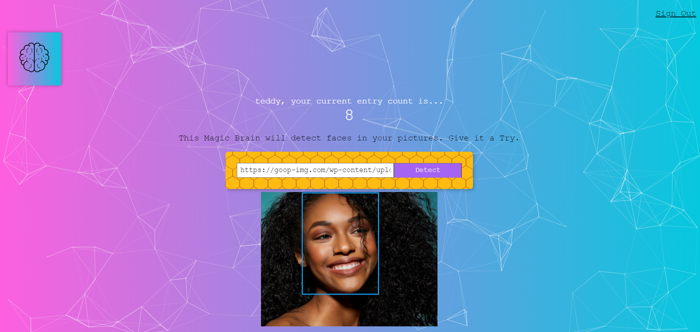

<div align="center">

<!-- 


[](https://github.com/blackphoenix42/Smart-Brain/blob/master/LICENSE) -->


<h3>Smart Brain</h3>
<h4>Join official <a href="https://discord.gg/mRUZEhD">Discord Server</a> for discussion.</h4>


</div>

# 📃About

An app that uses [Clarifai Api](https://www.clarifai.com/models/ai-face-detection) to detect the face in an image from an URL. Backend and Frontend are hosted on Heroku.

<div align="center">
	
</div>

# 🌱 Quick Start

- Star🌟 and Fork this repository

- Clone this repository remotely.

```sh
git clone https://github.com/blackphoenix42/Smart-Brain.git
```

- Star🌟 and Clone the [server repository](https://github.com/blackphoenix42/Smart-Brain-Server) and follow the instructions to start the server.

# 🕹Setup

- Install the dependencies

```sh
npm install
```

- Start the app

```sh
npm start
```

<div align="center"></div>

## 🚀 How to Contribute to Project?

- Take a look at the Existing [Issues](https://github.com/blackphoenix42/Smart-Brain/issues) or create your own Issues!
- Check out [CONTRIBUTING.md](./CONTRIBUTING.md)

<div align="center">
	
</div>

## 👾 Project Admin

<table>
	<tr>
		<td align="center">
			<a href="https://github.com/blackphoenix42">
				
				<br /> <sub><b>blackphoenix42</b></sub>
			</a>
			<br /> <a href="https://github.com/blackphoenix42">
		👑 Admin
	    </a>
		</td>
	</tr>
</table>

<!-- ## 🌟 Contributors

<table>
	<tr>
		<td>
			contrib.rocks
			</a>
		</td>
	</tr>
</table> -->
